# RESULTADOS DEL PROYECTO - CAMPUSLANDS GYM

## EVIDENCIAS DE IMPLEMENTACIÓN

### 0. Normalización y diagrama EER de las tablas

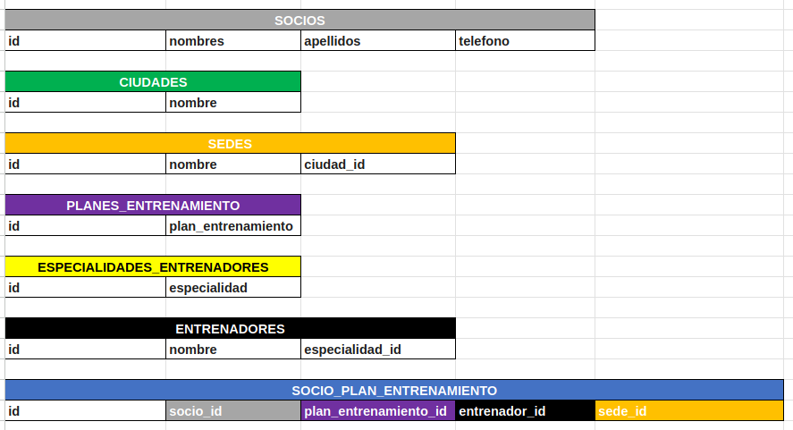
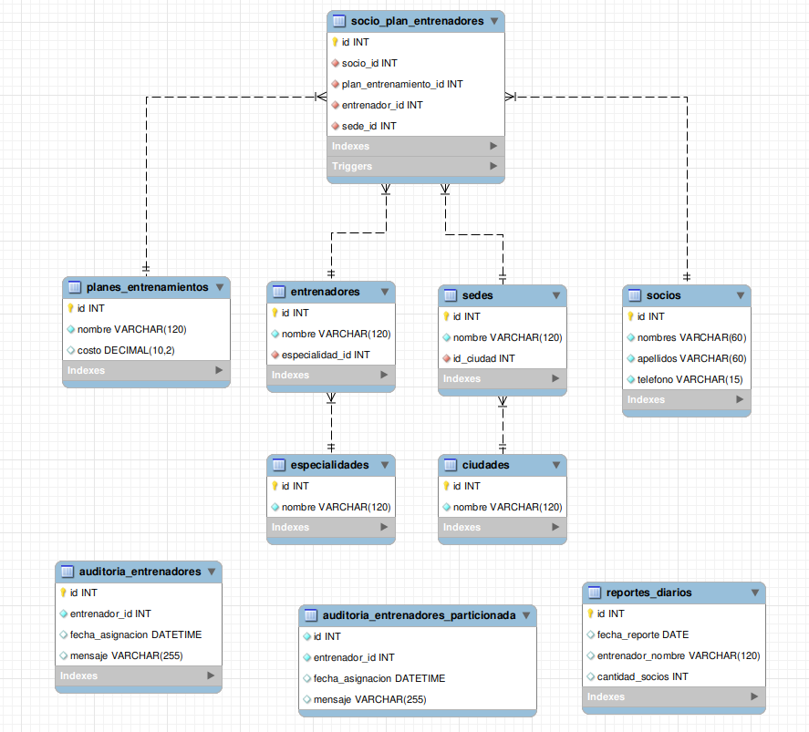

---

### 1. ESTRUCTURA DE BASE DE DATOS

#### Creación de tablas
Se crearon todas las tablas necesarias para el funcionamiento del gimnasio:
- socios: Almacena información de los socios
- ciudades: Catálogo de ciudades
- sedes: Información de las sedes del gimnasio
- planes_entrenamientos: Catálogo de planes disponibles
- especialidades: Especialidades de los entrenadores
- entrenadores: Información de los entrenadores
- socio_plan_entrenadores: Relación entre socios, planes y entrenadores

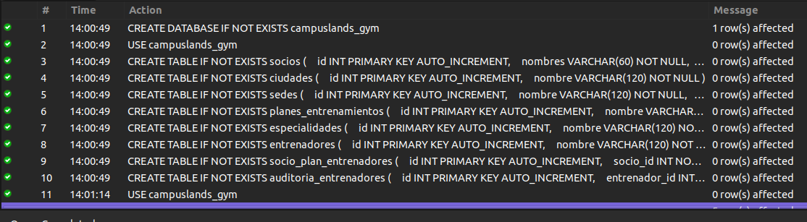

#### Inserción de datos
Se insertaron datos de prueba en todas las tablas:
- 5 ciudades
- 5 sedes
- 10 socios
- 8 planes de entrenamiento
- 7 especialidades
- 10 entrenadores
- 15 asignaciones socio-plan-entrenador

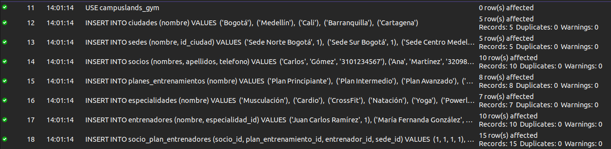

---

### 2. CONSULTAS AVANZADAS

#### Consulta 1: Uso de IN
Mostrar socios con planes específicos (principiante, intermedio, avanzado)

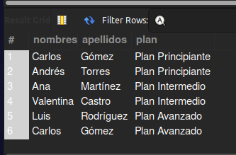

#### Consulta 2: INNER JOIN
Mostrar información completa de socios con sus entrenadores y sedes

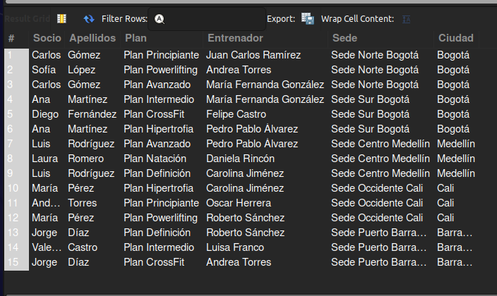

#### Consulta 3: LEFT JOIN (OUT)
Mostrar todos los entrenadores y cantidad de socios asignados

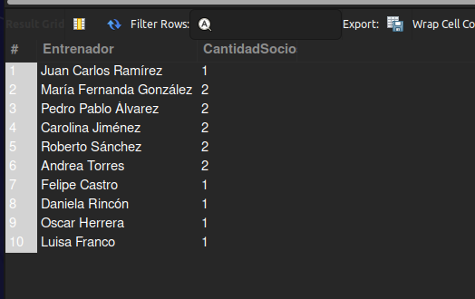

#### Consulta 4: RIGHT JOIN (INOUT)
Mostrar todas las sedes y cantidad de socios asignados

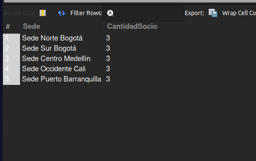

#### Consulta 5: CASE (IF_THEN_ELSE)
Clasificar socios según cantidad de planes que tienen

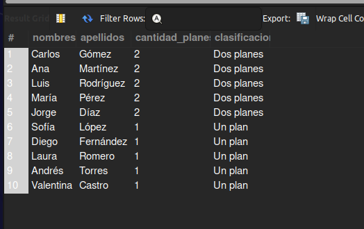

#### Consulta 6: Subconsulta
Mostrar entrenadores con más socios que el promedio

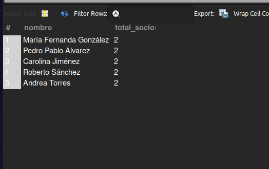

---

### 3. ESTRUCTURAS DE CONTROL

#### Procedimientos con WHILE
Se implementó un procedimiento que inserta socios de prueba usando WHILE

#### Procedimientos con REPEAT
Se implementó un procedimiento que actualiza nombres de planes usando REPEAT

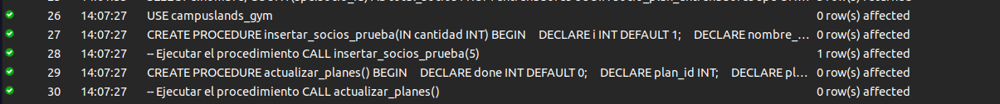

#### Procedimientos con LOOP
Se implementaron procedimientos con LOOP para crear planes automáticos y asignar socios aleatoriamente

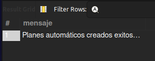

#### CASE en consultas y procedimientos

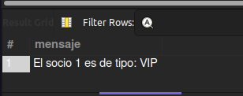 
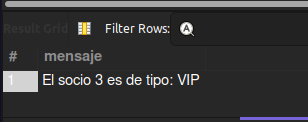

---

### 4. MANEJO DE ERRORES

#### Manejo de errores con código específico
Se implementó un procedimiento que maneja errores específicos como:
- Error 1048: Columna NOT NULL
- Error 1062: Clave duplicada
- Error 1364: Campo sin valor por defecto

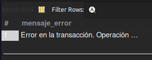 
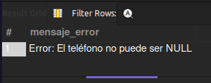

#### Manejo de errores con transacciones
Se implementó un procedimiento con transacciones que verifica:
- Existencia del socio
- Existencia del plan
- Existencia del entrenador
- Existencia de la sede
- Realiza ROLLBACK en caso de error

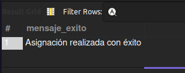 
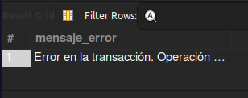

---

### 5. EVENTOS Y TRIGGERS

#### Evento: Reporte diario
Se creó un evento que genera automáticamente un reporte diario de la cantidad de socios por entrenador

#### Trigger: Verificar disponibilidad
Se implementó un trigger que verifica que un entrenador no tenga más de 3 socios asignados antes de una nueva asignación

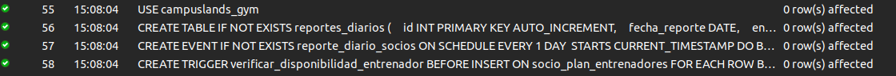

---

### 6. FUNCIONES CREADAS POR USUARIO

#### Función simple: Calcular comisión
Calcula la comisión del entrenador basada en el costo del plan

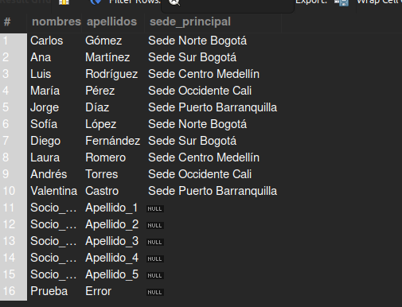 

#### Función con condiciones: Clasificar socio
Clasifica a los socios como Inactivo, Principiante, Regular o VIP según la cantidad de planes

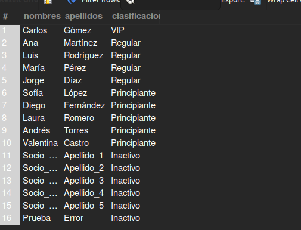 

#### Función con bucles: Contar socios
Cuenta la cantidad de socios asignados a un entrenador usando bucles

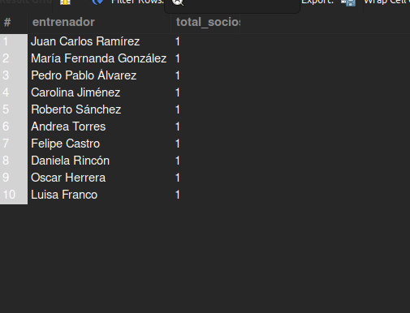 

#### Función que accede a datos: Obtener sede
Obtiene el nombre de la sede principal de un socio

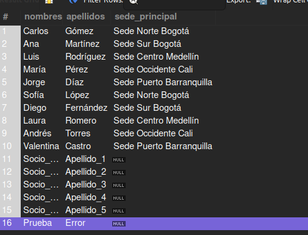

#### Función no determinística: Generar código
Genera un código único para cada socio usando fecha actual

 

#### Función con manejo de errores
Calcula socios por entrenador con validación de existencia

---

### 7. PARTICIONAMIENTO DE TABLAS

Se creó una tabla particionada para auditoría por rango de fechas (años 2023, 2024, 2025 y futuro)

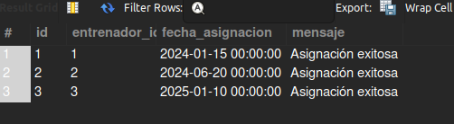 
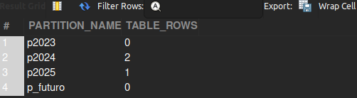

---

### 8. PREPARE, EXECUTE Y DEALLOCATE

Se implementaron consultas dinámicas usando sentencias preparadas

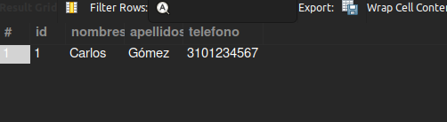 
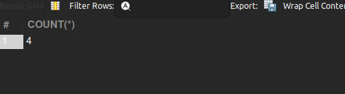

---

### 9. CREACIÓN DE USUARIOS Y PRIVILEGIOS

#### Creación de usuarios
Se crearon tres tipos de usuarios:
- usuario_gym: Usuario con permisos básicos
- admin_gym: Usuario con todos los permisos
- consultor_gym: Usuario con permisos limitados a columnas específicas

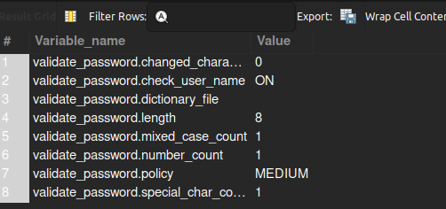

#### Asignación de permisos
- Permisos básicos: SELECT e INSERT en tablas específicas
- Permisos de administrador: ALL PRIVILEGES en toda la base de datos
- Permisos sobre columnas: SELECT solo en columnas específicas

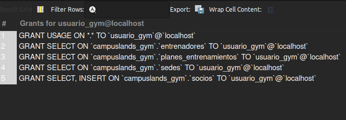
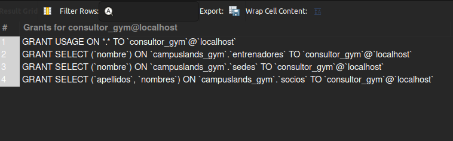

---

## RESUMEN DE RESULTADOS

Todos los requerimientos técnicos fueron implementados exitosamente:

Estructuras de Control: 100% completado
- WHILE: Implementado
- REPEAT: Implementado
- LOOP: Implementado
- CASE: Implementado

Manejo de Errores: 100% completado
- Código específico: Implementado
- Transacciones: Implementado

Consultas Avanzadas: 100% completado
- IN: Implementado
- INNER JOIN: Implementado
- OUT: Implementado
- INOUT: Implementado
- IF_THEN_ELSE: Implementado

Eventos y Triggers: 100% completado
- Evento diario: Implementado
- Trigger de disponibilidad: Implementado

Funciones: 100% completado
- Función simple: Implementada
- Función con condiciones: Implementada
- Función con bucles: Implementada
- Función que accede a datos: Implementada
- Función no determinística: Implementada
- Función con manejo de errores: Implementada

Partición de tablas: 100% completado

Prepare, Execute, Deallocate: 100% completado

Creación de usuarios y privilegios: 100% completado